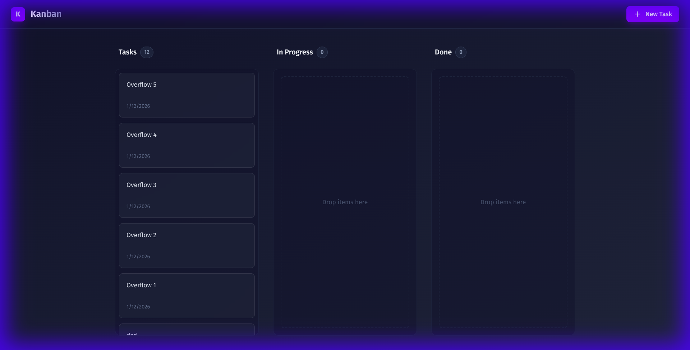

# Kanban Board Application

A modern, responsive Kanban board application built with React, TypeScript, and Tailwind CSS v4.



## Features

- **Drag & Drop**: smooth drag-and-drop functionality powered by `@dnd-kit`.
- **Persistent State**: Tasks are automatically saved to `localStorage`.
- **Modern UI**: Dark-themed, glassmorphism design with Tailwind CSS v4.
- **Task Management**: Create tasks, move them between columns (Tasks, In Progress, Done).
- **Responsive**: Scrollable columns with hidden scrollbars.

## Tech Stack

- **Framework**: Vite + React + TypeScript
- **Styling**: Tailwind CSS v4
- **Icons**: Lucide React
- **DnD**: @dnd-kit/core, @dnd-kit/sortable

## Getting Started

1. Clone the repository:

   ```bash
   git clone https://github.com/capebaldie/kanban-board.git
   ```

2. Install dependencies:

   ```bash
   npm install
   ```

3. Run the development server:
   ```bash
   npm run dev
   ```
